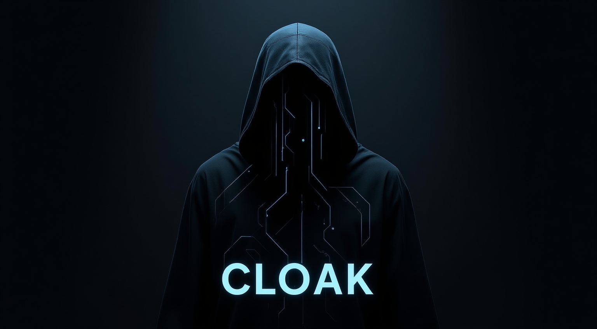
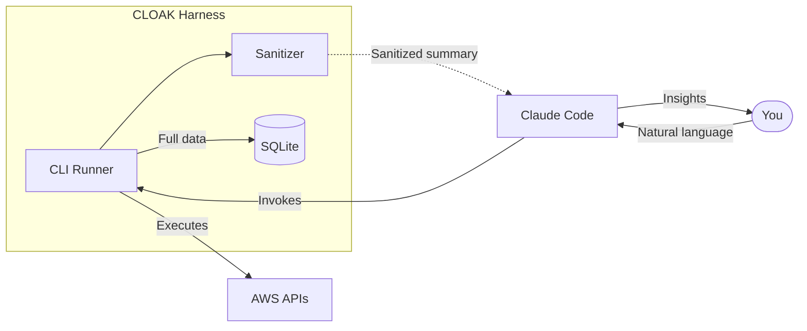

<p align="center">
  
</p>

<p align="center">
  <strong>An agent harness for cloud security.</strong>
</p>

<p align="center">
  <a href="https://github.com/openrec0n/cloak/releases"></a>
  <a href="https://www.python.org/downloads/"></a>
  <a href="LICENSE"></a>
</p>

---

## What is CLOAK?

CLOAK lets you run cloud security testing through Claude Code -- controlled, auditable, and privacy-first. No sensitive data ever enters AI context.

It's an **[agent harness](https://michaellivs.com/blog/agent-harness/)** -- the infrastructure layer that makes Claude Code an effective and safe security testing agent.

Agent frameworks handle the basic loop: call model, parse tools, execute, repeat. But they leave critical behaviors undefined: What context gets injected? How do tool outputs render for different consumers? When does the agent stop? What enforces safety?

CLOAK defines all of these for security testing:

| Harness Behavior | What CLOAK Does |
|-----------------|-----------------|
| **Tool Output Protocol** | Claude sees sanitized summaries. Full data (bucket names, ARNs, account IDs) stays in local SQLite. Your sensitive data never enters AI context. |
| **Tool Enforcement** | Dry-run previews every action. `--execute` flag required. Human confirmation before any AWS API call. |
| **Context Injection** | Skills load technique documentation when relevant. Registry provides discovery without bloating context. |
| **Queryable State** | Execution history persisted in SQLite. Retrieve details anytime via `--execution-info <id>`. |
| **Hooks** | Claude Code hooks enforce dry-run, DB access approval, session context, and output validation; see [Hooks](docs/hooks/). |

The result: agentic security testing that works - leveraging one of the world's most capable AI agents.

## Quick Start

```bash
git clone https://github.com/openrec0n/cloak.git
cd cloak && claude
```

Then open the project in **Claude Code** and start talking. Claude will handle setup automatically when needed, or you can ask it to run `/setup-cloak`.

> **Note:** Configure AWS credentials as usual (`~/.aws/credentials`, environment variables, or SSO). CLOAK will pick them up automatically.

**Then just ask:**

```
"What techniques are available?"

"Enumerate S3 buckets and check for public access"

"Show me IAM roles with overly permissive trust policies"
```

Claude identifies the right technique, shows you what it will do, and executes after you confirm.

## How the Harness Works



**Dual output rendering:** The harness serves two consumers differently. Claude receives aggregate counts and sanitized summaries - optimized for comprehension and token efficiency. Full results (resource names, ARNs, configurations) go to local SQLite - accessible to you anytime, never entering AI context.

When used with Claude Code, these behaviors are enforced by hooks registered in `.claude/settings.json`: session context and AWS validation at startup, dry-run and database-access approval before tool use, and output validation after. See [Hooks](docs/hooks/) for documentation on each hook.

## Capabilities

| Service | Techniques |
|---------|------------|
| **S3** | Bucket enumeration, ACL analysis, policy review |
| **IAM** | Users, roles, policies inventory and analysis |
| **EC2** | Instance enumeration, security groups, VPCs |
| **Lambda** | Function inventory, resource policy review |
| **STS** | Role assumption for cross-account testing |

Ask Claude Code `"What techniques are available?"` for the full list.

## Documentation

| Doc | Purpose |
|-----|---------|
| [Setup Guide](docs/SETUP.md) | AWS credentials and installation |
| [Architecture](docs/ARCHITECTURE.md) | Design principles and system overview |
| [Development](docs/DEVELOPMENT.md) | Adding new techniques |
| [Hooks](docs/hooks/) | Claude Code hooks (dry-run, DB approval, session context) |
| [Contributing](.github/CONTRIBUTING.md) | How to contribute |

## Explore with Claude

The best way to learn CLOAK is to use it. Open the project in Claude Code and ask:

- *"How does the privacy model work?"*
- *"Walk me through adding a new technique"*
- *"What's the architecture of this project?"*

Claude has full context on the codebase and can guide you through anything.

---

<details>
<summary><strong>About This Project</strong></summary>

<br>

CLOAK is a research project exploring **agent harness engineering** - the infrastructure layer that makes AI agents effective in production. We're investigating patterns for context management, tool output protocols, safety enforcement, and privacy boundaries.

The security domain is an ideal testbed: it requires handling sensitive data responsibly, enforcing strict operational controls, and maintaining queryable state across sessions. The patterns we're developing here apply broadly to any domain where agents need to be both capable and constrained.

This is an evolving project. Contributions, feedback, and ideas are welcome.

</details>