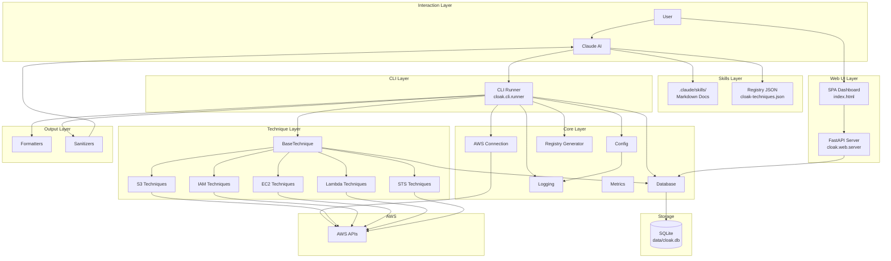

# CLOAK Architecture

## Overview

CLOAK transforms Claude Code into a specialized cloud security analyst. It's an integrated system combining knowledge (skills), execution infrastructure (Python CLI, techniques), data management (SQLite, sanitization), and safety controls (dry-run, confirmation) into a cohesive architecture. Users interact via Claude using natural language; the CLI executes techniques and stores full results locally while returning only sanitized summaries to the AI.

## Agent Harness Pattern

CLOAK implements the [agent harness](https://michaellivs.com/blog/agent-harness/) pattern-the architectural layer that manages everything agent frameworks leave undefined. Where frameworks define the loop (call model → parse tools → execute → repeat), harnesses define the behaviors that make agents effective in production.

### The Seven Harness Behaviors

| Behavior | Framework Provides | CLOAK Harness Defines |
|----------|-------------------|----------------------|
| **Tool Output Protocol** | Raw response passthrough | Dual rendering: sanitized summaries → Claude, full JSON → SQLite |
| **Conversation State** | Message list | Queryable `Execution` records tracking attempts, status, results |
| **System Reminders** | Static system prompt | Skills inject context at relevant points; registry provides discovery |
| **Stop Conditions** | `maxSteps` counter | Dry-run by default; explicit `--execute` required; validation gates |
| **Tool Enforcement** | None | Confirmation before AWS calls; parameter validation; safety controls |
| **Injection Queue** | None | Registry loads technique metadata; skills load on-demand |
| **Hooks** | None | `BaseTechnique` abstraction with `validate()`, `dry_run()`, `_execute_impl()`, `summarize()` |

### Why This Matters

The harness pattern addresses a fundamental problem: **LLMs are stateless, but effective agents need state**. CLOAK maintains:

- **Execution history** in SQLite, queryable via `--execution-info` or the Web UI
- **Privacy boundary** enforced by sanitizers-sensitive data never crosses into AI context. The Web UI serves as the primary "privacy boundary bridge," rendering full details in the browser outside AI context.
- **Safety guarantees** through mandatory dry-run and confirmation gates
- **Context efficiency** through progressive disclosure (skills load only when invoked)

This isn't a wrapper around boto3. It's a complete harness that makes Claude an effective security analyst while maintaining strict operational boundaries.

## Design Principles

### 1. Agent Never Sees Sensitive Data

Claude receives only sanitized summaries (counts, aggregations). Full results-bucket names, ARNs, resource IDs-are stored in SQLite (`data/cloak.db`) for human review. The **Web UI** (`cloak --web-ui`) is the primary way for users to browse full details in a visual dashboard, with `--execution-info <id>` available as a CLI fallback.

### 2. Progressive Disclosure

Claude Skills load minimal metadata at startup. Full technique documentation loads only when a skill is invoked.

### 3. Dry-Run by Default

Techniques show planned actions before execution. Users must confirm; the `--execute` flag is required for actual AWS API calls.

## System Workflow

The following diagram illustrates the complete workflow, highlighting the **privacy boundary** that separates what Claude sees from what stays local:

```
                              CLOAK SYSTEM WORKFLOW
    ═══════════════════════════════════════════════════════════════════════

    ┌─────────────────────────────────────────────────────────────────────┐
    │                         USER INTERACTION                            │
    └─────────────────────────────────────────────────────────────────────┘
                                     │
                                     ▼
    ┌─────────────────────────────────────────────────────────────────────┐
    │  USER: "List all S3 buckets in my account"                          │
    └─────────────────────────────────────────────────────────────────────┘
                                     │
                                     ▼
    ┌─────────────────────────────────────────────────────────────────────┐
    │                     CLAUDE CODE CONTEXT                             │
    │  ┌───────────────────────────────────────────────────────────────┐  │
    │  │  1. SKILL DISCOVERY                                           │  │
    │  │     • Reads .claude/skills/aws-s3/SKILL.md                    │  │
    │  │     • Loads technique registry (cloak-techniques.json)        │  │
    │  │     • Identifies: s3.list_buckets                             │  │
    │  └───────────────────────────────────────────────────────────────┘  │
    │                              │                                      │
    │                              ▼                                      │
    │  ┌───────────────────────────────────────────────────────────────┐  │
    │  │  2. DRY-RUN PREVIEW (Safety Gate)                             │  │
    │  │     $ python -m cloak.cli --technique s3.list_buckets         │  │
    │  │                                                               │  │
    │  │     [DRY-RUN] Planned actions:                                │  │
    │  │       - Call s3:ListAllMyBuckets (1 API call)                 │  │
    │  │       - Call s3:GetBucketLocation (N API calls)               │  │
    │  │     Required permissions: s3:ListAllMyBuckets, ...            │  │
    │  └───────────────────────────────────────────────────────────────┘  │
    │                              │                                      │
    │                              ▼                                      │
    │  ┌───────────────────────────────────────────────────────────────┐  │
    │  │  3. USER CONFIRMATION                                         │  │
    │  │     Claude: "Ready to list S3 buckets. Proceed?"              │  │
    │  │     User: "Yes, go ahead"                                     │  │
    │  └───────────────────────────────────────────────────────────────┘  │
    └─────────────────────────────────────────────────────────────────────┘
                                     │
                                     │  --execute flag added
                                     ▼
    ┌─────────────────────────────────────────────────────────────────────┐
    │                      TECHNIQUE EXECUTION                            │
    │  ┌───────────────────────────────────────────────────────────────┐  │
    │  │  $ python -m cloak.cli --technique s3.list_buckets --execute  │  │
    │  │                                                               │  │
    │  │  ┌─────────────┐    ┌─────────────┐    ┌─────────────────┐    │  │
    │  │  │  Validate   │───▶│  AWS APIs   │───▶│  Full Results   │    │  │
    │  │  │  Config     │    │  (boto3)    │    │  Captured       │    │  │
    │  │  └─────────────┘    └─────────────┘    └─────────────────┘    │  │
    │  └───────────────────────────────────────────────────────────────┘  │
    └─────────────────────────────────────────────────────────────────────┘
                                     │
    ═════════════════════════════════╪═════════════════════════════════════
                                     │
              ┌──────────────────────┴──────────────────────┐
              │            PRIVACY BOUNDARY                 │
              │   (Sensitive data NEVER crosses this line)  │
              └──────────────────────┬──────────────────────┘
                                     │
         ┌───────────────────────────┼───────────────────────────┐
         │                           │                           │
         ▼                           │                           ▼
    ┌─────────────────────┐          │          ┌─────────────────────────┐
    │   LOCAL STORAGE     │          │          │   SANITIZED SUMMARY     │
    │   (Human Access)    │          │          │   (Claude Context)      │
    │                     │          │          │                         │
    │  ┌───────────────┐  │          │          │  ┌───────────────────┐  │
    │  │   SQLite DB   │  │          │          │  │  Aggregate Counts │  │
    │  │ data/cloak.db │  │          │          │  │  Region Stats     │  │
    │  └───────────────┘  │          │          │  │  Finding Summary  │  │
    │                     │          │          │  └───────────────────┘  │
    │  CONTAINS:          │          │          │                         │
    │  • Bucket names     │          │          │  EXAMPLE OUTPUT:        │
    │  • ARNs             │          │          │  ┌───────────────────┐  │
    │  • Account IDs      │          │          │  │ "Discovered 15    │  │
    │  • Resource IDs     │          │          │  │  buckets across   │  │
    │  • IP addresses     │          │          │  │  3 regions.       │  │
    │  • Full configs     │          │          │  │                   │  │
    │                     │          │          │  │  - us-east-1: 8   │  │
    │  execution_id:      │          │          │  │  - us-west-2: 5   │  │
    │  abc-123-def        │◀─────────┼──────────│  │  - eu-west-1: 2"  │  │
    │                     │   Link   │          │  └───────────────────┘  │
    └─────────────────────┘          │          └─────────────────────────┘
              │                      │                       │
              │                      │                       │
              ▼                      │                       ▼
    ┌─────────────────────┐          │          ┌─────────────────────────┐
    │  HUMAN RETRIEVAL    │          │          │    CLAUDE RESPONSE      │
    │                     │          │          │                         │
    │  PRIMARY: Web UI    │          │          │  "I found 15 S3 buckets │
    │  localhost:8080/    │          │          │   distributed across 3  │
    │  #/executions/      │          │          │   regions. View details │
    │  abc-123-def        │          │          │   at: localhost:8080/   │
    │                     │          │          │   #/executions/abc-123" │
    │  FALLBACK: CLI      │          │          │                         │
    │  $ cloak            │          │          │                         │
    │    --execution-info │          │          │                         │
    │    abc-123-def      │          │          │                         │
    └─────────────────────┘          │          └─────────────────────────┘
                                     │
    ═════════════════════════════════╧═════════════════════════════════════


    SANITIZER BLOCKS THESE PATTERNS FROM ENTERING CLAUDE'S CONTEXT:
    ┌─────────────────────────────────────────────────────────────────────┐
    │  • ARNs           arn:aws:s3:::my-secret-bucket                     │
    │  • Account IDs    123456789012                                      │
    │  • Resource IDs   i-0abc123, sg-456def, vpc-789ghi                  │
    │  • IP Addresses   10.0.1.50, 192.168.1.1                            │
    │  • Access Keys    AKIA..., ASIA...                                  │
    │  • Bucket URLs    mybucket.s3.amazonaws.com                         │
    │  • IAM Paths      user/admin, role/SecurityAudit                    │
    └─────────────────────────────────────────────────────────────────────┘
```

## System Architecture



**Execution Flow:**
1. User request → Claude identifies technique via Skills/Registry
2. Claude invokes CLI with technique name and parameters
3. Dry-run preview shown → User confirms with `--execute`
4. Technique runs → Full data stored in SQLite
5. Sanitized summary returned to stdout → Claude displays summary with Web UI deep link
6. User browses full details in Web UI (outside AI context)

| Data       | Location       | Contains                    | Who sees it   |
|-----------|----------------|-----------------------------|---------------|
| Summary   | stdout → AI    | Counts, aggregations        | AI + user     |
| Full data | SQLite         | Resource names, ARNs, etc.  | Human only    |
| Deep link | stdout → AI    | Web UI URL for execution    | AI + user     |
| Dashboard | Web UI browser | Full details, charts, drill-down | Human only |

## Components

### Core (`cloak/core/`)

- **Configuration** (`config.py`): Hierarchy of defaults, environment variables (`CLOAK_*`), and runtime overrides. Defines `CLOAKConfig`, `TechniqueConfig`, and `ParameterSpec`.
- **Database** (`database.py`, `models.py`): SQLite storage with SQLAlchemy ORM. Session management and query helpers.
- **AWS Connection** (`aws_connection.py`): boto3 credential chain, STS identity validation, client/resource caching.
- **Logging** (`logging.py`): Structured logging via structlog with automatic sensitive-data redaction.
- **Registry** (`registry.py`): Generates and loads compressed technique metadata JSON for programmatic discovery. Output stored at `.claude/skills/cloak-techniques.json`.
- **Metrics** (`metrics.py`): Token usage estimation and tracking for context optimization.

### Techniques (`cloak/techniques/`)

- **BaseTechnique** (`base.py`): Abstract contract defining `metadata`, `validate()`, `dry_run()`, `_execute_impl()`, and `summarize()`. The `run()` method dispatches to dry-run or execute based on config.
- **Service Modules**: Implementations organized by AWS service-`s3/`, `iam/`, `ec2/`, `lambda_/`, `sts/`. Each module exports a `TECHNIQUES` dict for dynamic loading.

### Output (`cloak/output/`)

- **Formatters** (`formatters.py`): JSON and text output formatting for `ExecutionResult` and `DryRunResult`.
- **Sanitizers** (`sanitizers.py`): Validates summaries for sensitive data patterns (ARNs, account IDs, IP addresses, resource IDs) before returning to Claude. Provides `validate_summary()` and `sanitize_text()`.

### CLI (`cloak/cli/`)

- **Runner** (`runner.py`): Main entry point. Handles technique loading via registry, parameter parsing, dry-run/execute dispatch, and output formatting.

### Web UI (`cloak/web/`)

The Web UI is the **privacy boundary bridge**-the human-only interface for viewing full sensitive data that Claude is prevented from seeing.

- **Server** (`server.py`): FastAPI application providing REST API endpoints for querying executions, assets, and findings. Includes SSE endpoint (`/api/events`) for real-time updates. Supports foreground and background (daemon) modes.
- **Agent Status** (`/api/agent-status`): WebSocket endpoint for real-time agent lifecycle events. When the CLI runs a technique, it POSTs to `/api/agent-events`; the server broadcasts to connected WebSocket clients. The UI shows "Agent running X..." and toasts on completion.
- **SPA** (`static/index.html`): Single-page application with client-side routing. Dark theme, cybersecurity-focused aesthetic. Views: Dashboard (stats, charts), Executions (list + detail), Findings (list + detail). No build step required.
- **Deep Links**: The CLI includes `web_ui_url` in execution output so Claude can direct users to specific pages (e.g., `http://localhost:8080/#/executions/<id>`).

**Data flow**: SPA → FastAPI REST API → SQLAlchemy → SQLite (`data/cloak.db`). Techniques are run via the CLI; results are written to the database and browsed in the Web UI.

### Skills (`.claude/skills/`)

- Markdown-based technique discovery and documentation for Claude.
- `cloak-techniques.json`: Compressed registry for token-efficient technique enumeration.

## Data Models

Three core models in `cloak/core/models.py` track execution state and results:

```
Execution (1) ──→ (*) Asset ──→ (*) Finding
```

| Model | Purpose | Key Fields |
|-------|---------|------------|
| **Execution** | Tracks technique run lifecycle | `id`, `technique_name`, `status`, `aws_account_id`, `aws_identity_arn`, `summary`, `asset_count`, `finding_count` |
| **Asset** | Discovered cloud resources (OCSF-compatible) | `resource_type`, `resource_id`, `resource_arn`, `region`, `account_id`, `data_json` |
| **Finding** | Security findings with severity | `severity` (CRITICAL/HIGH/MEDIUM/LOW/INFO), `finding_type`, `title`, `description`, `recommendation` |

## Technique Lifecycle

When `execute()` is called on a technique:

1. **Validate** - Check configuration via `validate()`
2. **Create Record** - Insert `Execution` row with PENDING status
3. **Mark Running** - Update status, log start
4. **Execute** - Call `_execute_impl()` → returns `(assets, findings)`
5. **Store Results** - Persist assets and findings to SQLite
6. **Summarize** - Generate safe summary via `summarize()` (no sensitive data)
7. **Complete** - Mark execution COMPLETED or FAILED
8. **Return** - `ExecutionResult` with sanitized summary for Claude

Dry-run mode (`--technique` without `--execute`) calls only `dry_run()` and skips database initialization.

## Security

- **Credentials:** boto3 credential chain only; never stored or logged. Validated via STS before execution.
- **Output:** Summaries exclude resource identifiers; full data stays local; logs filter sensitive patterns.
- **Execution:** Dry-run by default, user confirmation required before any AWS API calls.

## Hooks

CLOAK uses Claude Code hooks to enforce safety controls at key lifecycle points. Hooks intercept events like session start, prompt submission, and tool execution to validate credentials, filter sensitive data from prompts, enforce dry-run workflow, and warn about potential data leakage in outputs.

Hook configuration lives in `.claude/settings.json` with scripts in `.claude/hooks/`. See [docs/hooks/](hooks/) for detailed documentation on each hook.

## Related Documentation

- [SETUP.md](SETUP.md) - AWS configuration and installation
- [TROUBLESHOOTING.md](TROUBLESHOOTING.md) - Common issues and solutions
- [DEVELOPMENT.md](DEVELOPMENT.md) - Technique implementation guide
- [hooks/](hooks/) - Claude Code hook documentation
- [.github/CONTRIBUTING.md](../.github/CONTRIBUTING.md) - Contribution guidelines
- [AGENTS.md](../AGENTS.md) - AI agent development context
